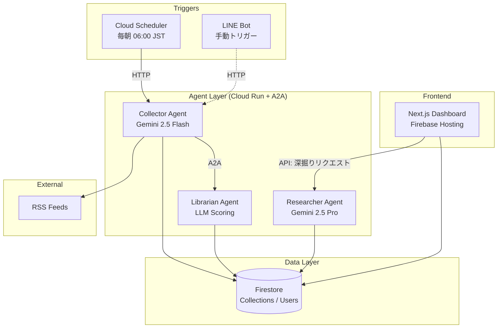
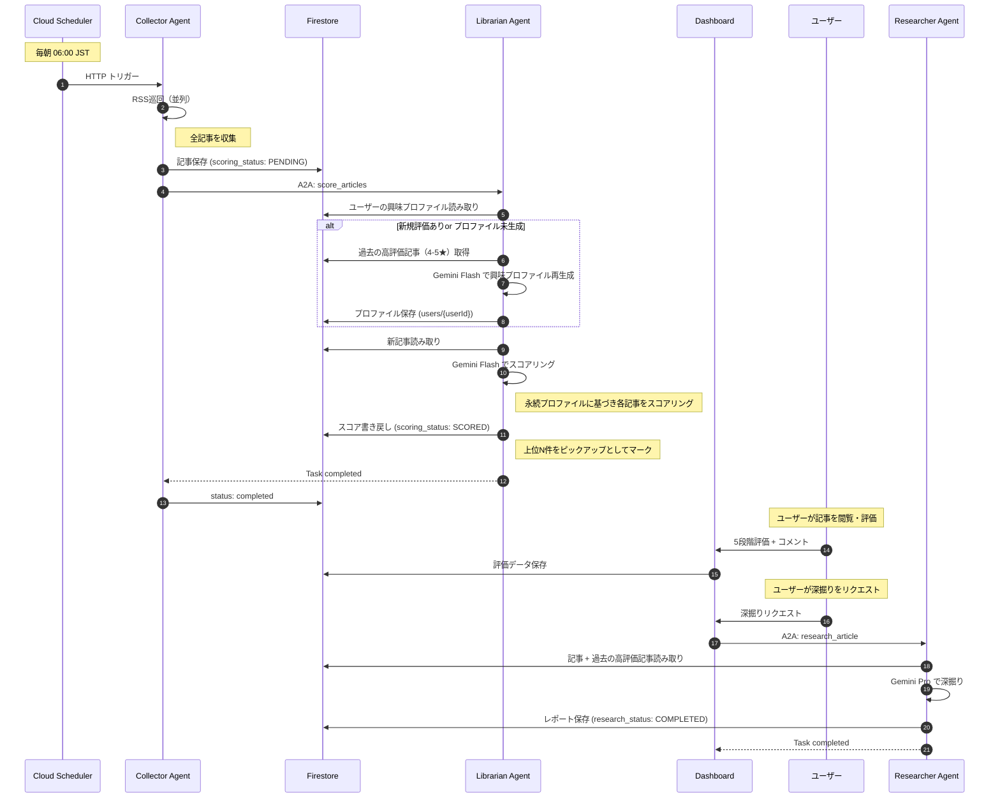

# Curation Persona - Design Document

> **対象**: [Google Cloud Japan AI Hackathon Vol.4](https://zenn.dev/hackathons/google-cloud-japan-ai-hackathon-vol4?tab=rule)
>
> **スコープ**: ハッカソンMVP（本番運用は対象外）

---

## 1. 設計概要 (Design Overview)

### 1.1 設計方針

| 方針 | 説明 |
|------|------|
| **シンプルさ優先** | ハッカソン期間内に動くものを作る。過度な抽象化は避ける |
| **コスト意識** | LLM呼び出しを最小限に。バッチ処理で1日1回に集約 |
| **標準プロトコル** | エージェント間は A2A プロトコルで連携。相互運用性を確保 |

### 1.2 設計判断の記録 (ADR)

> 詳細は [ADR.md](./ADR.md) を参照

---

## 2. システムアーキテクチャ (System Architecture)

### 2.1 全体構成図



### 2.2 コンポーネント責務

| コンポーネント | 責務 | 技術 |
|----------------|------|------|
| **Collector Agent** | RSS巡回、初期フィルタリング、エージェント連携の起点 | Cloud Run, Python, Gemini Flash |
| **Librarian Agent** | ユーザー評価ベースのLLMスコアリング | Cloud Run, Python, Gemini Flash |
| **Researcher Agent** | 詳細レポート生成、Firestore保存 | Cloud Run, Python, Gemini Pro |
| **Dashboard** | レポート表示、ユーザー認証、評価・深掘りリクエスト | Next.js, Firebase Auth |

---

## 3. データモデル (Data Models)

### 3.1 Firestore スキーマ

```
firestore/
├── users/{userId}
│   ├── sources: [                    // 記事ソース設定（拡張可能）
│   │     {
│   │       id: string                // "src_001"
│   │       type: "rss" | "website" | "newsletter" | "api"
│   │       name: string              // "Hacker News"
│   │       enabled: boolean
│   │       config: {                 // タイプ固有の設定
│   │         url?: string
│   │         selector?: string       // website用
│   │         email_filter?: string   // newsletter用
│   │       }
│   │     }
│   │   ]
│   ├── interestProfile: string | null  // LLM生成の興味プロファイル（永続保持）
│   ├── interestProfileUpdatedAt: timestamp | null  // プロファイル最終更新日時
│   ├── preferences: {
│   │     dailyReportTime: string     // "06:00"
│   │   }
│   └── createdAt: timestamp
│
└── collections/{collectionId}        // 日次の記事コレクション
    ├── userId: string
    ├── date: string                  // "2025-01-15"
    ├── articles: [
    │     {
    │       title: string
    │       url: string
    │       source: string
    │       sourceType: "rss" | "website" | "newsletter" | "api"
    │       content: string
    │       publishedAt: timestamp
    │       scoringStatus: "pending" | "scoring" | "scored"
    │       relevanceScore: number    // 0.0 - 1.0
    │       relevanceReason: string   // 過去の高評価記事との関連理由
    │       isPickup: boolean
    │       researchStatus: "pending" | "researching" | "completed" | null
    │       deepDiveReport: string | null
    │       userRating: number | null // 1-5 の5段階評価
    │       userComment: string | null // ユーザーコメント
    │     }
    │   ]
    ├── status: "collecting" | "scoring" | "researching" | "completed" | "failed"
    └── createdAt: timestamp
```

### 3.2 A2A メッセージ形式

> エージェント間通信は [A2A プロトコル](https://a2a-protocol.org/latest/) に準拠

#### Collector → Librarian（score_articles スキル呼び出し）
```json
{
  "jsonrpc": "2.0",
  "method": "message/send",
  "params": {
    "message": {
      "role": "user",
      "parts": [{
        "type": "data",
        "data": {
          "skill": "score_articles",
          "userId": "user_123",
          "collectionId": "collection_user_123_20250115"
        }
      }]
    }
  },
  "id": "req_001"
}
```

#### Dashboard API → Researcher（research_article スキル呼び出し / 手動トリガー）

> ユーザーがDashboardから「深掘りリクエスト」を送信すると、Dashboard APIがResearcher AgentにA2Aメッセージを送信する。

```json
{
  "jsonrpc": "2.0",
  "method": "message/send",
  "params": {
    "message": {
      "role": "user",
      "parts": [{
        "type": "data",
        "data": {
          "skill": "research_article",
          "userId": "user_123",
          "collectionId": "collection_user_123_20250115",
          "articleUrl": "https://example.com/article"
        }
      }]
    }
  },
  "id": "req_002"
}
```

#### Agent Card 例（Collector Agent）
```json
{
  "name": "Collector Agent",
  "description": "RSS記事を収集しスコアリングを依頼するエージェント",
  "url": "https://collector-agent-xxx.run.app",
  "skills": [
    {
      "id": "collect_articles",
      "name": "記事収集",
      "description": "ユーザーのRSSソースから記事を収集"
    }
  ],
  "capabilities": {
    "streaming": false,
    "pushNotifications": false
  }
}
```

---

## 4. API設計

> 詳細は [API_design.md](./API_design.md) を参照

---

## 5. 処理フロー (Processing Flow)

### 5.1 日次バッチ処理シーケンス



---

## 6. エラーハンドリング (Error Handling)

### 6.1 方針

| エラー種別 | 対応 |
|------------|------|
| RSS取得失敗 | スキップして次のソースへ。ログ記録のみ |
| LLM API エラー | 最大3回リトライ（exponential backoff） |
| LLMスコアリングエラー | 関連性スコア0として処理継続 |
| 評価データ不足（コールドスタート） | スコア0.5固定、全記事を時系列表示 |

### 6.2 リトライ設定

```python
# エージェント共通設定
RETRY_CONFIG = {
    "max_retries": 3,
    "initial_delay_sec": 1,
    "max_delay_sec": 30,
    "exponential_base": 2
}
```

---

## 7. セキュリティ設計 (Security)

### 7.1 認証・認可

```
┌─────────────────┐     ┌─────────────────┐
│   Dashboard     │────▶│  Firebase Auth  │
│   (Frontend)    │     │  (Google OAuth) │
└─────────────────┘     └─────────────────┘
         │
         │ ID Token
         ▼
┌─────────────────┐
│   Cloud Run     │  ← Firebase Admin SDK で検証
│   (Backend)     │
└─────────────────┘
```

### 7.2 Firestore Security Rules

```javascript
rules_version = '2';
service cloud.firestore {
  match /databases/{database}/documents {
    // ユーザーは自分のデータのみアクセス可能
    match /users/{userId} {
      allow read, write: if request.auth != null && request.auth.uid == userId;
    }

    match /collections/{collectionId} {
      allow read: if request.auth != null &&
                     resource.data.userId == request.auth.uid;
      allow write: if false; // バックエンドのみ書き込み可
    }
  }
}
```

---

## 8. 環境構成 (Environments)

### 8.1 ハッカソン向け（単一環境）

| 項目 | 値 |
|------|-----|
| GCPプロジェクト | `curation-persona` |
| リージョン | `asia-northeast1` (東京) |
| Cloud Run インスタンス | 最小0、最大3 |
| Firestore モード | Native mode |

### 8.2 環境変数

```bash
# Cloud Run 共通
GOOGLE_CLOUD_PROJECT=curation-persona
FIRESTORE_DATABASE=(default)

# A2A エージェント間通信
LIBRARIAN_AGENT_URL=https://librarian-agent-xxx.run.app
RESEARCHER_AGENT_URL=https://researcher-agent-xxx.run.app

# エージェント固有
GEMINI_FLASH_MODEL=gemini-2.5-flash
GEMINI_PRO_MODEL=gemini-2.5-pro
```

---

## 9. モニタリング（ハッカソン向け簡易版）

### 9.1 確認すべきメトリクス

| メトリクス | 確認場所 | アラート閾値 |
|------------|----------|--------------|
| Cloud Run エラー率 | Cloud Console | 手動確認 |
| A2A 通信レイテンシ | Cloud Logging | 手動確認 |
| LLM API コスト | GCP Billing | $10/日 超えたら停止 |

### 9.2 ログ出力

```python
import logging
from google.cloud import logging as cloud_logging

# Cloud Logging に構造化ログを出力
logger = logging.getLogger(__name__)

logger.info("Article processed", extra={
    "userId": user_id,
    "articleUrl": url,
    "relevanceScore": score
})
```

---

## 10. 今後の拡張（本番化時の検討事項）

> ハッカソン後に本番運用する場合の検討事項

- [ ] マルチテナント対応（ユーザー増加時のスケーリング）
- [ ] MCPサーバー経由での評価・コメントDB公開（ADR-012）
- [ ] Vector Searchによるハイブリッドスコアリング再導入（ADR-003）
- [ ] CI/CD パイプライン構築
- [ ] 負荷テスト実施
- [ ] SLA定義とモニタリング強化
