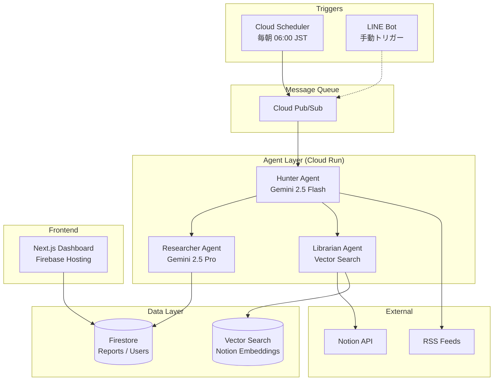
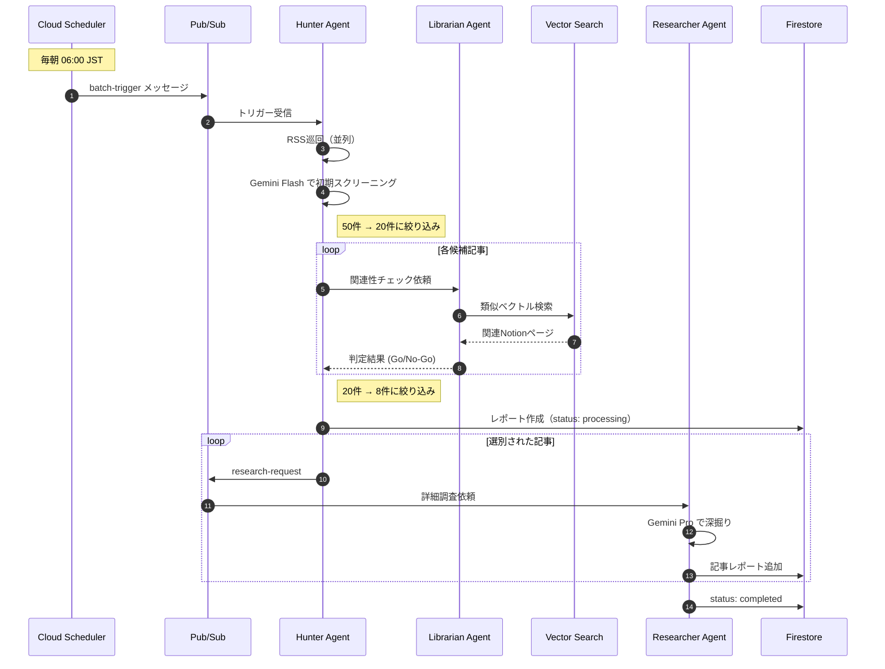

# Curation Persona - Design Document

> **対象**: [Google Cloud Japan AI Hackathon Vol.4](https://zenn.dev/hackathons/google-cloud-japan-ai-hackathon-vol4?tab=rule)
>
> **スコープ**: ハッカソンMVP（本番運用は対象外）

---

## 1. 設計概要 (Design Overview)

### 1.1 設計方針

| 方針 | 説明 |
|------|------|
| **シンプルさ優先** | ハッカソン期間内に動くものを作る。過度な抽象化は避ける |
| **コスト意識** | LLM呼び出しを最小限に。バッチ処理で1日1回に集約 |
| **疎結合** | エージェント間はPub/Sub経由で非同期連携。個別にテスト可能 |

### 1.2 設計判断の記録 (ADR)

> 詳細は [ADR.md](./ADR.md) を参照

---

## 2. システムアーキテクチャ (System Architecture)

### 2.1 全体構成図



### 2.2 コンポーネント責務

| コンポーネント | 責務 | 技術 |
|----------------|------|------|
| **Hunter Agent** | RSS巡回、初期フィルタリング、エージェント連携の起点 | Cloud Run, Python, Gemini Flash |
| **Librarian Agent** | ユーザーコンテキストとの関連性判定 | Cloud Run, Python, Vector Search |
| **Researcher Agent** | 詳細レポート生成、Firestore保存 | Cloud Run, Python, Gemini Pro |
| **Dashboard** | レポート表示、ユーザー認証、フィードバック収集 | Next.js, Firebase Auth |

---

## 3. データモデル (Data Models)

### 3.1 Firestore スキーマ

```
firestore/
├── users/{userId}
│   ├── notionAccessToken: string (encrypted)
│   ├── notionWorkspaceId: string
│   ├── rssSources: string[]
│   ├── preferences: {
│   │     dailyReportTime: string  // "06:00"
│   │   }
│   └── createdAt: timestamp
│
├── reports/{reportId}
│   ├── userId: string
│   ├── date: string              // "2025-01-15"
│   ├── articles: [
│   │     {
│   │       title: string
│   │       url: string
│   │       source: string
│   │       summary: string
│   │       relevanceScore: number  // 0.0 - 1.0
│   │       relevanceReason: string
│   │       relatedNotionPages: string[]
│   │       deepDiveReport: string
│   │       userFeedback: "positive" | "neutral" | "negative" | null
│   │     }
│   │   ]
│   ├── status: "processing" | "completed" | "failed"
│   └── createdAt: timestamp
│
└── notionEmbeddings/{embeddingId}
    ├── userId: string
    ├── notionPageId: string
    ├── notionPageTitle: string
    ├── content: string           // 元テキスト（デバッグ用）
    ├── embeddingVector: number[] // Vector Search側で管理
    └── updatedAt: timestamp
```

### 3.2 Pub/Sub メッセージ形式

#### Topic: `batch-trigger`
```json
{
  "type": "daily_batch",
  "userId": "user_123",
  "triggeredAt": "2025-01-15T06:00:00+09:00"
}
```

#### Topic: `research-request`
```json
{
  "userId": "user_123",
  "reportId": "report_456",
  "article": {
    "title": "...",
    "url": "...",
    "relevanceScore": 0.85,
    "relevanceReason": "..."
  }
}
```

---

## 4. API設計

> 詳細は [API_design.md](./API_design.md) を参照

---

## 5. 処理フロー (Processing Flow)

### 5.1 日次バッチ処理シーケンス



---

## 6. エラーハンドリング (Error Handling)

### 6.1 方針

| エラー種別 | 対応 |
|------------|------|
| RSS取得失敗 | スキップして次のソースへ。ログ記録のみ |
| LLM API エラー | 最大3回リトライ（exponential backoff） |
| Vector Search エラー | 関連性スコア0として処理継続 |
| Notion API エラー | キャッシュがあれば使用、なければスキップ |

### 6.2 リトライ設定

```python
# エージェント共通設定
RETRY_CONFIG = {
    "max_retries": 3,
    "initial_delay_sec": 1,
    "max_delay_sec": 30,
    "exponential_base": 2
}
```

---

## 7. セキュリティ設計 (Security)

### 7.1 認証・認可

```
┌─────────────────┐     ┌─────────────────┐
│   Dashboard     │────▶│  Firebase Auth  │
│   (Frontend)    │     │  (Google OAuth) │
└─────────────────┘     └─────────────────┘
         │
         │ ID Token
         ▼
┌─────────────────┐
│   Cloud Run     │  ← Firebase Admin SDK で検証
│   (Backend)     │
└─────────────────┘
```

### 7.2 Firestore Security Rules

```javascript
rules_version = '2';
service cloud.firestore {
  match /databases/{database}/documents {
    // ユーザーは自分のデータのみアクセス可能
    match /users/{userId} {
      allow read, write: if request.auth != null && request.auth.uid == userId;
    }

    match /reports/{reportId} {
      allow read: if request.auth != null &&
                     resource.data.userId == request.auth.uid;
      allow write: if false; // バックエンドのみ書き込み可
    }
  }
}
```

---

## 8. 環境構成 (Environments)

### 8.1 ハッカソン向け（単一環境）

| 項目 | 値 |
|------|-----|
| GCPプロジェクト | `curation-persona` |
| リージョン | `asia-northeast1` (東京) |
| Cloud Run インスタンス | 最小0、最大3 |
| Firestore モード | Native mode |

### 8.2 環境変数

```bash
# Cloud Run 共通
GOOGLE_CLOUD_PROJECT=curation-persona
FIRESTORE_DATABASE=(default)
PUBSUB_TOPIC_BATCH=batch-trigger
PUBSUB_TOPIC_RESEARCH=research-request

# エージェント固有
GEMINI_FLASH_MODEL=gemini-2.5-flash
GEMINI_PRO_MODEL=gemini-2.5-pro
VECTOR_SEARCH_INDEX_ENDPOINT=projects/.../indexes/...

# 外部連携（Notion Internal Integration）
NOTION_TOKEN=ntn_xxx  # ユーザーが発行したInternal Integration Token
```

---

## 9. モニタリング（ハッカソン向け簡易版）

### 9.1 確認すべきメトリクス

| メトリクス | 確認場所 | アラート閾値 |
|------------|----------|--------------|
| Cloud Run エラー率 | Cloud Console | 手動確認 |
| Pub/Sub 未処理メッセージ | Cloud Console | 手動確認 |
| LLM API コスト | GCP Billing | $10/日 超えたら停止 |

### 9.2 ログ出力

```python
import logging
from google.cloud import logging as cloud_logging

# Cloud Logging に構造化ログを出力
logger = logging.getLogger(__name__)

logger.info("Article processed", extra={
    "userId": user_id,
    "articleUrl": url,
    "relevanceScore": score
})
```

---

## 10. 今後の拡張（本番化時の検討事項）

> ハッカソン後に本番運用する場合の検討事項

- [ ] マルチテナント対応（ユーザー増加時のスケーリング）
- [ ] Notion OAuth の本番申請
- [ ] セキュリティ監査（Notion トークンの暗号化強化）
- [ ] CI/CD パイプライン構築
- [ ] 負荷テスト実施
- [ ] SLA定義とモニタリング強化
