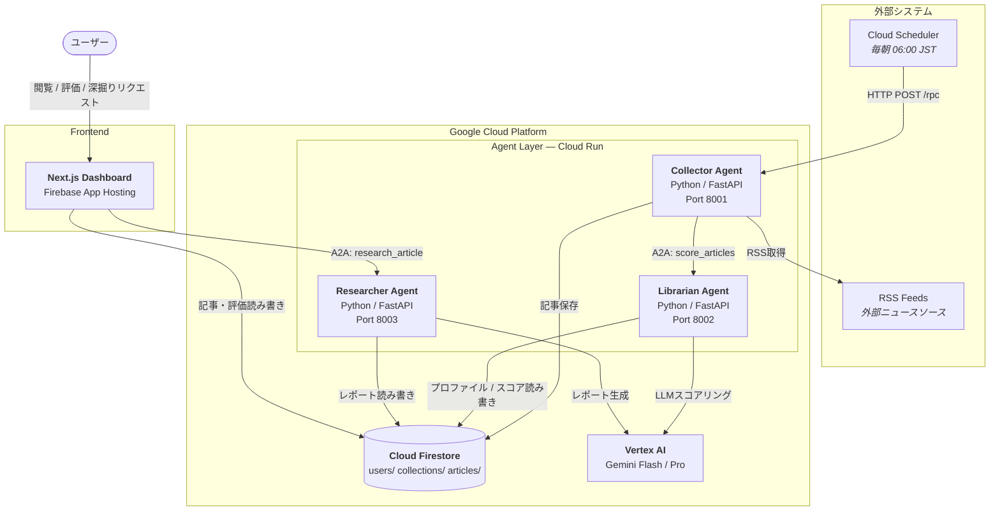
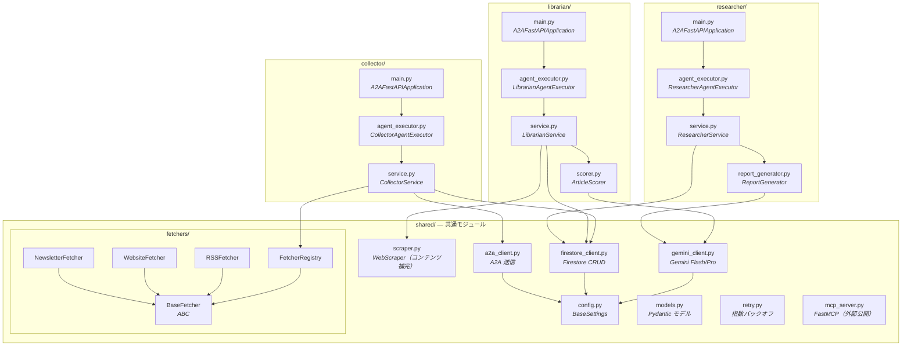

# バックエンド実装設計書

> **対象**: Curation Persona - Agent Layer (Cloud Run)
>
> **スコープ**: ハッカソンMVP

---

## 1. 概要

バックエンドは3つのAIエージェントで構成される。各エージェントはCloud Run上で独立したサービスとして動作し、[A2Aプロトコル](https://a2a-protocol.org/latest/)を介して連携する。

### 1.1 エージェント一覧

| エージェント | 役割 | LLMモデル |
|-------------|------|-----------|
| Collector Agent | RSS巡回、記事収集、フロー制御 | - |
| Librarian Agent | 全記事への関連性スコア付与、ピックアップ選定 | Gemini 2.5 Flash (LLMスコアリング) |
| Researcher Agent | ユーザーリクエストによる詳細レポート生成 | Gemini 2.5 Pro |

### 1.2 設計方針

- **ソース厳選**: RSSソースをユーザーが厳選することで、取得記事の品質を担保
- **全件表示**: 取得した記事は全て「本日のニュース」として表示
- **ピックアップ深掘り**: 関連性スコア上位N件のみResearcherで詳細レポート生成
- **コスト最適化**: 高コストなGemini Proはピックアップ記事のみに使用

### 1.3 技術スタック

| カテゴリ | 技術 |
|----------|------|
| 言語 | Python 3.11+ |
| Webフレームワーク | FastAPI + a2a-sdk (`pip install "a2a-sdk[http-server]"`) |
| LLM SDK | google-genai (Vertex AI) |
| エージェント間通信 | A2A Protocol (a2a-sdk v0.3.22+) |
| データベース | Cloud Firestore |

---

## 2. アーキテクチャ（C4 Model）

### 2.1 L2: Container（デプロイ単位）

> システムを構成するデプロイ可能な単位と、その間の通信を示す。



**通信プロトコル一覧**

| From | To | プロトコル | エンドポイント |
|------|----|-----------|---------------|
| Cloud Scheduler | Collector | HTTP POST (JSON-RPC) | `/rpc` |
| Collector | Librarian | A2A (JSON-RPC) | `/rpc` |
| Dashboard API | Researcher | A2A (JSON-RPC) | `/rpc` |
| 各Agent | Firestore | gRPC (SDK) | — |
| Librarian / Researcher | Vertex AI | REST (SDK) | — |
| Dashboard | Firestore | REST (Firebase JS SDK) | — |

### 2.2 L3: Component（Agent Layer 内部構成）

> Agent Layer 内のモジュール依存関係を示す。各エージェントは `shared/` を共有する。



---

## 3. 処理フロー

### 3.1 全体フロー図

```
Cloud Scheduler (毎朝6時)
    │
    ▼ HTTP トリガー
┌─────────────────────────────────────┐
│ Collector Agent (A2A Server)        │
│  - RSS取得（ソースは厳選済み）       │
│  - 全記事をFirestoreに保存           │
│    (scoring_status: PENDING)        │
└─────────────────────────────────────┘
    │
    │ Firestore: 記事保存
    ▼ A2A: score_articles
┌─────────────────────────────────────┐
│ Librarian Agent (A2A Server)        │
│  - 過去の高評価記事（4-5★）を取得    │
│  - Gemini Flashで興味プロファイル生成 │
│  - 全記事にLLMベーススコア付与       │
│  - 上位N件をピックアップとしてマーク  │
│    (is_pickup: true)                │
│  - 上位10件のコンテンツ補完          │
│    (WebScraper / robots.txt準拠)    │
│  - Firestoreにスコア書き戻し         │
│    (scoring_status: SCORED)         │
└─────────────────────────────────────┘
    │
    │ Firestore: スコア更新
    ▼ バッチ処理完了

┌─────────────────────────────────────┐
│ Dashboard API（ユーザー手動トリガー） │
│  - ユーザーが「深掘りリクエスト」送信 │
└─────────────────────────────────────┘
    │
    ▼ A2A: research_article
┌─────────────────────────────────────┐
│ Researcher Agent (A2A Server)       │
│  - Firestoreから対象記事読み取り     │
│  - 過去の高評価記事のコンテキスト取得│
│  - 詳細レポート生成                  │
│  - Firestoreに保存                   │
│    (research_status: COMPLETED)     │
└─────────────────────────────────────┘
```

### 3.2 Dashboard での表示イメージ

```
┌─────────────────────────────────────┐
│ 📰 本日のニュース (15件)            │
├─────────────────────────────────────┤
│ ⭐ ピックアップ (詳細レポート付き)   │
│   • AI Agent の新設計パターン        │  ← 詳細レポートあり
│   • Gemini 2.5 の新機能発表          │  ← 関連メモとの紐付け
├─────────────────────────────────────┤
│ 📋 その他のニュース                  │
│   • React 19 リリース               │  ← 表示のみ
│   • GitHub Copilot アップデート     │
│   • ...                              │
└─────────────────────────────────────┘
```

---

## 4. プロジェクト構成

```
services/agents/
├── shared/                     # 共通モジュール
│   ├── __init__.py
│   ├── config.py              # 環境変数・設定
│   ├── firestore_client.py    # Firestore操作
│   ├── a2a_client.py          # A2A通信クライアント
│   ├── gemini_client.py       # Gemini API操作
│   ├── models.py              # Pydanticモデル定義
│   ├── scraper.py             # Webスクレイピング（コンテンツ補完）
│   ├── retry.py               # リトライユーティリティ
│   └── fetchers/              # 記事取得モジュール（拡張可能）
│       ├── __init__.py
│       ├── base.py            # BaseFetcher（共通インターフェース）
│       ├── registry.py        # FetcherRegistry（ファクトリ）
│       ├── rss_fetcher.py     # RSS取得
│       ├── website_fetcher.py # Webサイト監視
│       └── newsletter_fetcher.py  # メルマガ取得
│
├── collector/                  # Collector Agent
│   ├── main.py                # A2A Server エントリポイント（A2AFastAPIApplication）
│   ├── agent_executor.py      # AgentExecutor 実装
│   ├── service.py             # ビジネスロジック
│   ├── Dockerfile
│   └── requirements.txt
│
├── librarian/                  # Librarian Agent
│   ├── main.py                # A2A Server エントリポイント（A2AFastAPIApplication）
│   ├── agent_executor.py      # AgentExecutor 実装
│   ├── service.py             # ビジネスロジック
│   ├── scorer.py              # 関連性スコアリング
│   ├── Dockerfile
│   └── requirements.txt
│
├── researcher/                 # Researcher Agent
│   ├── main.py                # A2A Server エントリポイント（A2AFastAPIApplication）
│   ├── agent_executor.py      # AgentExecutor 実装
│   ├── service.py             # ビジネスロジック
│   ├── report_generator.py    # レポート生成 + 異業種フィードバック
│   ├── Dockerfile
│   └── requirements.txt
│
├── mcp_server.py              # MCPサーバー（Claude Desktop連携）
└── pyproject.toml              # 共通依存関係
```

---

## 5. 共通モジュール (shared/)

### 5.1 config.py - 環境変数管理

```python
from pydantic_settings import BaseSettings

class Settings(BaseSettings):
    # GCP
    google_cloud_project: str
    firestore_database: str = "(default)"

    # A2A エージェント間通信
    librarian_agent_url: str  # Librarian Agent の URL
    researcher_agent_url: str  # Researcher Agent の URL

    # Gemini
    gemini_flash_model: str = "gemini-2.5-flash"
    gemini_pro_model: str = "gemini-2.5-pro"

    # ピックアップ設定
    pickup_count: int = 2  # ピックアップとしてマークする記事数

    # スコアリング設定
    min_ratings_for_scoring: int = 3  # スコアリングに必要な最低評価数
    high_rating_threshold: int = 4     # 高評価とみなす最低評価値（4-5★）

    # スクレイピング設定
    scrape_max_count: int = 10         # コンテンツ補完対象の上位記事数
    scrape_delay_sec: float = 2.0      # 逐次取得の待機秒数

    class Config:
        env_file = ".env"

settings = Settings()
```

### 5.2 models.py - 共通データモデル

```python
from pydantic import BaseModel, Field
from typing import Optional
from datetime import datetime
from enum import Enum

class CollectionStatus(str, Enum):
    """記事コレクションのステータス"""
    COLLECTING = "collecting"    # 収集中
    SCORING = "scoring"          # スコアリング中
    RESEARCHING = "researching"  # 詳細調査中（ピックアップ記事）
    COMPLETED = "completed"      # 完了
    FAILED = "failed"            # 失敗

class ScoringStatus(str, Enum):
    """スコアリングのステータス（全記事共通）"""
    PENDING = "pending"      # 収集済み、未スコアリング
    SCORING = "scoring"      # スコアリング中
    SCORED = "scored"        # スコアリング完了

class ResearchStatus(str, Enum):
    """詳細調査のステータス（ピックアップ記事のみ）"""
    PENDING = "pending"          # 詳細調査待ち
    RESEARCHING = "researching"  # 詳細調査中
    COMPLETED = "completed"      # 詳細調査完了
    FAILED = "failed"            # 失敗

# ソース設定
class SourceType(str, Enum):
    """記事ソースの種別"""
    RSS = "rss"                  # RSSフィード
    WEBSITE = "website"          # Webサイト監視
    NEWSLETTER = "newsletter"    # メルマガ
    API = "api"                  # 外部API
    BOOKMARK = "bookmark"        # ブックマーク

class SourceConfig(BaseModel):
    """記事ソースの設定"""
    id: str                      # ソースID（例: "src_001"）
    type: SourceType             # ソース種別
    name: str                    # 表示名（例: "Hacker News"）
    enabled: bool = True         # 有効/無効
    config: dict = {}            # チャンネル固有の設定

    # config の例:
    # RSS:        { "url": "https://example.com/feed" }
    # WEBSITE:    { "url": "https://blog.example.com", "selector": ".post-list", "link_selector": "a" }
    # NEWSLETTER: { "email_filter": "from:news@example.com" }
    # API:        { "endpoint": "https://api.example.com/articles", "api_key_env": "EXAMPLE_API_KEY" }

class Article(BaseModel):
    """各ソースから取得した記事"""
    title: str
    url: str
    source: str                  # ソース名（SourceConfig.name）
    source_type: SourceType      # ソース種別
    content: Optional[str] = None
    summary: Optional[str] = None
    meta_description: Optional[str] = None
    published_at: Optional[datetime] = None

class CrossIndustryPerspective(BaseModel):
    industry: str
    expert_comment: str

class CrossIndustryFeedback(BaseModel):
    abstracted_challenge: str
    perspectives: list[CrossIndustryPerspective]

class ScoredArticle(Article):
    """関連性スコア付きの記事"""
    id: Optional[str] = None

    # スコアリング関連（全記事共通）
    scoring_status: ScoringStatus = ScoringStatus.PENDING
    relevance_score: float = 0.0  # 0.0 - 1.0
    relevance_reason: str = ""    # 過去の高評価記事との関連理由

    # ピックアップ関連（ピックアップ記事のみ使用）
    is_pickup: bool = False
    research_status: Optional[ResearchStatus] = None  # ピックアップ時のみ設定
    deep_dive_report: Optional[str] = None
    cross_industry_feedback: Optional[CrossIndustryFeedback] = None

    # ユーザー評価
    user_rating: Optional[int] = Field(None, ge=1, le=5)  # 1-5 の5段階評価
    user_comment: Optional[str] = None

class ArticleCollection(BaseModel):
    """日次の記事コレクション（収集した記事の集合）"""
    id: str
    user_id: str
    date: str  # "2025-01-15"
    articles: list[ScoredArticle] = []  # 全記事（ピックアップ含む）
    status: CollectionStatus
    created_at: datetime

# A2A スキルパラメータ
class ScoreArticlesParams(BaseModel):
    """score_articles スキル: Collector → Librarian"""
    user_id: str
    collection_id: str

class BookmarkRequest(BaseModel):
    url: str
    api_key: str

class ResearchArticleParams(BaseModel):
    """research_article スキル: Librarian → Researcher"""
    user_id: str
    collection_id: str
    article_url: str  # 記事を特定するためのURL
```

### 5.3 retry.py - リトライユーティリティ

```python
import asyncio
from functools import wraps
from typing import TypeVar, Callable
import logging
import httpx
from google.api_core.exceptions import GoogleAPIError, ServiceUnavailable, ResourceExhausted

logger = logging.getLogger(__name__)

RETRY_CONFIG = {
    "max_retries": 3,
    "initial_delay_sec": 1,
    "max_delay_sec": 30,
    "exponential_base": 2
}

# リトライ対象のHTTPステータスコード
RETRYABLE_STATUS_CODES = {429, 500, 502, 503, 504}

# リトライ対象の例外
RETRYABLE_EXCEPTIONS = (
    httpx.TimeoutException,      # タイムアウト
    httpx.NetworkError,          # ネットワークエラー
    ServiceUnavailable,          # GCP 503
    ResourceExhausted,           # GCP 429 (レート制限)
)

T = TypeVar("T")

def is_retryable(exception: Exception) -> bool:
    """リトライ可能なエラーかどうかを判定"""
    # 明示的にリトライ対象の例外
    if isinstance(exception, RETRYABLE_EXCEPTIONS):
        return True

    # HTTPステータスコードでの判定
    if isinstance(exception, httpx.HTTPStatusError):
        return exception.response.status_code in RETRYABLE_STATUS_CODES

    # Google API エラーのステータスコード判定
    if isinstance(exception, GoogleAPIError):
        if hasattr(exception, 'code') and exception.code in RETRYABLE_STATUS_CODES:
            return True

    return False

def with_retry(func: Callable[..., T]) -> Callable[..., T]:
    @wraps(func)
    async def wrapper(*args, **kwargs) -> T:
        delay = RETRY_CONFIG["initial_delay_sec"]
        max_retries = RETRY_CONFIG["max_retries"]
        last_exception = None

        for attempt in range(max_retries):
            try:
                return await func(*args, **kwargs)
            except Exception as e:
                last_exception = e

                # リトライ不可能なエラーは即座に再送出
                if not is_retryable(e):
                    logger.error(f"Non-retryable error: {e}")
                    raise

                # 何回目/最大回数 の形式でログ出力
                logger.warning(
                    f"Retry {attempt + 1}/{max_retries} failed: {e}"
                )

                if attempt < max_retries - 1:
                    logger.info(f"Retrying in {delay}s...")
                    await asyncio.sleep(delay)
                    delay = min(
                        delay * RETRY_CONFIG["exponential_base"],
                        RETRY_CONFIG["max_delay_sec"]
                    )

        logger.error(f"All {max_retries} retries exhausted")
        raise last_exception

    return wrapper
```

### 5.4 fetchers/ - 記事取得モジュール

記事ソースの種類（RSS、Webサイト、メルマガ等）に応じた取得ロジックを拡張可能な形で実装する。

#### 5.4.1 base.py - 共通インターフェース

```python
from abc import ABC, abstractmethod
from shared.models import Article, SourceConfig

class BaseFetcher(ABC):
    """記事取得の共通インターフェース"""

    @abstractmethod
    async def fetch(self, config: SourceConfig) -> list[Article]:
        """
        設定に基づいて記事を取得

        Args:
            config: ソース設定（URL、セレクタ等）

        Returns:
            取得した記事のリスト
        """
        pass

    @abstractmethod
    def supports(self, source_type: str) -> bool:
        """
        このFetcherが対応するソースタイプか判定

        Args:
            source_type: ソース種別（"rss", "website" 等）

        Returns:
            対応している場合 True
        """
        pass
```

#### 5.4.2 registry.py - Fetcherレジストリ

```python
import logging
from typing import Optional
from .base import BaseFetcher

logger = logging.getLogger(__name__)

class FetcherRegistry:
    """Fetcherの登録・取得を管理するレジストリ"""

    def __init__(self):
        self._fetchers: list[BaseFetcher] = []

    def register(self, fetcher: BaseFetcher):
        """Fetcherを登録"""
        self._fetchers.append(fetcher)
        logger.info(f"Registered fetcher: {fetcher.__class__.__name__}")

    def get_fetcher(self, source_type: str) -> Optional[BaseFetcher]:
        """ソースタイプに対応するFetcherを取得"""
        for fetcher in self._fetchers:
            if fetcher.supports(source_type):
                return fetcher
        return None

    def get_fetcher_or_raise(self, source_type: str) -> BaseFetcher:
        """ソースタイプに対応するFetcherを取得（なければ例外）"""
        fetcher = self.get_fetcher(source_type)
        if fetcher is None:
            raise ValueError(f"No fetcher registered for source type: {source_type}")
        return fetcher
```

#### 5.4.3 rss_fetcher.py - RSS取得

```python
import feedparser
import asyncio
from datetime import datetime, timedelta
import logging

from shared.models import Article, SourceConfig, SourceType
from .base import BaseFetcher

logger = logging.getLogger(__name__)

class RSSFetcher(BaseFetcher):
    """RSSフィードから記事を取得"""

    def __init__(self, max_age_days: int = 1):
        self.max_age_days = max_age_days

    def supports(self, source_type: str) -> bool:
        return source_type == SourceType.RSS.value

    async def fetch(self, config: SourceConfig) -> list[Article]:
        url = config.config.get("url")
        if not url:
            logger.warning(f"No URL in config for source: {config.name}")
            return []

        loop = asyncio.get_event_loop()
        feed = await loop.run_in_executor(None, feedparser.parse, url)

        cutoff_date = datetime.now() - timedelta(days=self.max_age_days)
        articles = []

        for entry in feed.entries:
            published = self._parse_date(entry.get("published"))

            if published and published < cutoff_date:
                continue

            article = Article(
                title=entry.get("title", ""),
                url=entry.get("link", ""),
                source=config.name,
                source_type=SourceType.RSS,
                content=entry.get("summary", ""),
                published_at=published
            )
            articles.append(article)

        logger.info(f"Fetched {len(articles)} articles from RSS: {config.name}")
        return articles

    def _parse_date(self, date_str: str | None) -> datetime | None:
        if not date_str:
            return None
        try:
            from dateutil.parser import parse
            return parse(date_str)
        except Exception:
            return None
```

#### 5.4.4 website_fetcher.py - Webサイト監視（MVP後に実装）

```python
import httpx
from bs4 import BeautifulSoup
import logging

from shared.models import Article, SourceConfig, SourceType
from .base import BaseFetcher

logger = logging.getLogger(__name__)

class WebsiteFetcher(BaseFetcher):
    """Webサイトを監視して新規記事を取得"""

    def supports(self, source_type: str) -> bool:
        return source_type == SourceType.WEBSITE.value

    async def fetch(self, config: SourceConfig) -> list[Article]:
        url = config.config.get("url")
        selector = config.config.get("selector", "article")
        link_selector = config.config.get("link_selector", "a")

        if not url:
            logger.warning(f"No URL in config for source: {config.name}")
            return []

        async with httpx.AsyncClient() as client:
            response = await client.get(url)
            response.raise_for_status()

        soup = BeautifulSoup(response.text, "html.parser")
        articles = []

        for element in soup.select(selector):
            link = element.select_one(link_selector)
            if not link:
                continue

            article = Article(
                title=link.get_text(strip=True),
                url=link.get("href", ""),
                source=config.name,
                source_type=SourceType.WEBSITE,
                content=element.get_text(strip=True)[:500],
                published_at=None  # 別途パースが必要
            )
            articles.append(article)

        logger.info(f"Fetched {len(articles)} articles from website: {config.name}")
        return articles
```

#### 5.4.5 newsletter_fetcher.py - メルマガ取得（MVP後に実装）

```python
import logging

from shared.models import Article, SourceConfig, SourceType
from .base import BaseFetcher

logger = logging.getLogger(__name__)

class NewsletterFetcher(BaseFetcher):
    """メルマガから記事を取得（Gmail API等を使用）"""

    def supports(self, source_type: str) -> bool:
        return source_type == SourceType.NEWSLETTER.value

    async def fetch(self, config: SourceConfig) -> list[Article]:
        # TODO: Gmail API または Cloud Pub/Sub (Gmail Push) を使用して実装
        # 1. email_filter に基づいてメールを検索
        # 2. メール本文からリンクを抽出
        # 3. Article に変換

        logger.warning("NewsletterFetcher is not yet implemented")
        return []
```

#### 5.4.6 __init__.py - レジストリ初期化

```python
from .registry import FetcherRegistry
from .rss_fetcher import RSSFetcher
from .website_fetcher import WebsiteFetcher
from .newsletter_fetcher import NewsletterFetcher

# グローバルレジストリを初期化
fetcher_registry = FetcherRegistry()

# 利用可能なFetcherを登録
fetcher_registry.register(RSSFetcher())
fetcher_registry.register(WebsiteFetcher())
fetcher_registry.register(NewsletterFetcher())

__all__ = ["fetcher_registry", "FetcherRegistry", "BaseFetcher"]
```

---

## 6. Collector Agent

### 6.1 責務

- Cloud Scheduler からのトリガー受信
- **複数ソース（RSS、Webサイト、メルマガ等）から記事を収集**
- **FetcherRegistryを使用して拡張可能な取得処理**
- **Firestoreに全記事を保存**（scoring_status: PENDING）
- **A2AでLibrarianにスコアリング依頼**（score_articles スキル）

### 6.2 main.py - A2A Server エントリポイント

> a2a-sdk v0.3.22+ の `A2AFastAPIApplication` を使用。Agent Card定義もここに含める。

```python
from a2a.server.apps import A2AFastAPIApplication
from a2a.server.request_handlers import DefaultRequestHandler
from a2a.server.tasks import InMemoryTaskStore
from a2a.types import AgentCard, AgentSkill, AgentCapabilities
from fastapi import FastAPI
import uvicorn

from .agent_executor import CollectorAgentExecutor

def create_app() -> FastAPI:
    # Agent Card 定義
    skill = AgentSkill(
        id="collect_articles",
        name="記事収集",
        description="ユーザーのソース設定に基づいて記事を収集し、Librarianにスコアリングを依頼",
        tags=["collector", "rss"],
        examples=["記事を収集して"],
    )
    agent_card = AgentCard(
        name="Collector Agent",
        description="RSS/Webサイトから記事を収集し、スコアリングを依頼するエージェント",
        url="http://localhost:8001/",  # デプロイ時に環境変数で上書き
        version="0.1.0",
        defaultInputModes=["text/plain"],
        defaultOutputModes=["text/plain"],
        capabilities=AgentCapabilities(streaming=False),
        skills=[skill],
    )

    # A2A Server 構築
    handler = DefaultRequestHandler(
        agent_executor=CollectorAgentExecutor(),
        task_store=InMemoryTaskStore(),
    )
    a2a_app = A2AFastAPIApplication(
        agent_card=agent_card,
        http_handler=handler,
    )
    app: FastAPI = a2a_app.build()

    @app.get("/health")
    async def health():
        return {"status": "healthy"}

    return app

app = create_app()

if __name__ == "__main__":
    uvicorn.run(app, host="0.0.0.0", port=8001)
```

### 6.2.1 agent_executor.py - AgentExecutor 実装

> `AgentExecutor` は a2a-sdk の抽象基底クラス。`execute()` でビジネスロジックを実行し、`EventQueue` にレスポンスを発行する。

```python
from a2a.server.agent_execution import AgentExecutor, RequestContext
from a2a.server.events import EventQueue
from a2a.types import DataPart
from a2a.utils import new_agent_text_message
import logging

from .service import CollectorService

logger = logging.getLogger(__name__)
service = CollectorService()

class CollectorAgentExecutor(AgentExecutor):
    """Collector Agent の A2A リクエストハンドラ"""

    async def execute(
        self, context: RequestContext, event_queue: EventQueue
    ) -> None:
        # リクエストメッセージからパラメータを取得
        params = {}
        if context.message:
            for part in context.message.parts:
                if hasattr(part, 'root') and isinstance(part.root, DataPart):
                    params = part.root.data
                    break

        user_id = params.get("user_id", "")
        logger.info(f"Starting article collection for user: {user_id}")

        result = await service.execute(user_id)

        event_queue.enqueue_event(
            new_agent_text_message(
                f"Collection completed: {result['articles_total']} articles collected "
                f"(collection_id: {result['collection_id']})"
            )
        )

    async def cancel(
        self, context: RequestContext, event_queue: EventQueue
    ) -> None:
        raise NotImplementedError("cancel not supported")
```

### 6.3 service.py - ビジネスロジック

```python
from datetime import datetime
import asyncio
import logging

from shared.config import settings
from shared.firestore_client import FirestoreClient
from shared.a2a_client import A2AClient
from shared.fetchers import fetcher_registry
from shared.models import (
    ArticleCollection, CollectionStatus, ScoredArticle, ScoringStatus,
    ScoreArticlesParams, SourceConfig
)

logger = logging.getLogger(__name__)

class CollectorService:
    def __init__(self):
        self.firestore = FirestoreClient()
        self.a2a_client = A2AClient()
        self.fetcher_registry = fetcher_registry

    async def execute(self, user_id: str) -> dict:
        # 1. ユーザーのソース設定を取得
        user = await self.firestore.get_user(user_id)
        sources = [
            SourceConfig.model_validate(s)
            for s in user.get("sources", [])
        ]

        # 2. 各ソースから記事を並列収集
        articles = await self._fetch_all_sources(sources)
        logger.info(f"Fetched {len(articles)} articles from {len(sources)} sources")

        # 3. 重複URLを除去（同一バッチ内）
        articles = self._deduplicate(articles)

        # 4. 全記事をScoredArticleに変換（scoring_status: PENDING）
        scored_articles = [
            ScoredArticle(
                **article.model_dump(),
                scoring_status=ScoringStatus.PENDING
            )
            for article in articles
        ]

        # 5. 記事コレクション作成（Firestoreに保存）
        collection = ArticleCollection(
            id=f"collection_{user_id}_{datetime.now().strftime('%Y%m%d')}",
            user_id=user_id,
            date=datetime.now().strftime("%Y-%m-%d"),
            articles=scored_articles,
            status=CollectionStatus.SCORING,  # 次はスコアリング
            created_at=datetime.now()
        )
        await self.firestore.create_collection(collection)
        logger.info(f"Created collection: {collection.id} with {len(scored_articles)} articles")

        # 6. Librarian にスコアリング依頼（A2A）
        params = ScoreArticlesParams(
            user_id=user_id,
            collection_id=collection.id
        )
        await self.a2a_client.send_message(
            agent_url=settings.librarian_agent_url,
            skill="score_articles",
            params=params.model_dump()
        )
        logger.info(f"Sent A2A score_articles request for collection: {collection.id}")

        return {
            "status": "success",
            "articles_total": len(scored_articles),
            "collection_id": collection.id
        }

    async def _fetch_all_sources(
        self,
        sources: list[SourceConfig]
    ) -> list:
        """複数ソースから並列で記事を取得"""
        tasks = []
        for source in sources:
            if not source.enabled:
                continue

            fetcher = self.fetcher_registry.get_fetcher(source.type.value)
            if fetcher is None:
                logger.warning(f"No fetcher for source type: {source.type}")
                continue

            tasks.append(self._fetch_with_error_handling(fetcher, source))

        results = await asyncio.gather(*tasks)
        # フラット化
        return [article for articles in results for article in articles]

    async def _fetch_with_error_handling(
        self,
        fetcher,
        source: SourceConfig
    ) -> list:
        """エラーハンドリング付きで記事を取得"""
        try:
            return await fetcher.fetch(source)
        except Exception as e:
            logger.warning(f"Fetch failed for {source.name}: {e}")
            return []

    def _deduplicate(self, articles: list) -> list:
        """URLで重複を除去"""
        seen_urls = set()
        unique = []
        for article in articles:
            if article.url not in seen_urls:
                seen_urls.add(article.url)
                unique.append(article)
        return unique
```

---

## 7. Librarian Agent

### 7.1 責務

- **A2A（score_articles スキル）でCollectorからトリガー受信**
- **Firestoreから記事を読み取り**
- **過去の高評価記事（4-5★）からユーザー興味プロファイルを生成**
- **全記事にLLMベーススコアを付与**（Gemini Flash）
- **Firestoreにスコアを書き戻し**（scoring_status: SCORED）
- **ピックアップ判定**（上位N件をマーク）
- **コールドスタート対応**（評価データ不足時はスコア0.5固定）

### 7.2 main.py - A2A Server エントリポイント

```python
from a2a.server.apps import A2AFastAPIApplication
from a2a.server.request_handlers import DefaultRequestHandler
from a2a.server.tasks import InMemoryTaskStore
from a2a.types import AgentCard, AgentSkill, AgentCapabilities
from fastapi import FastAPI
import uvicorn

from .agent_executor import LibrarianAgentExecutor

def create_app() -> FastAPI:
    skill = AgentSkill(
        id="score_articles",
        name="記事スコアリング",
        description="コレクション内の全記事にユーザー評価ベースの関連性スコアを付与",
        tags=["librarian", "scoring"],
        examples=["記事をスコアリングして"],
    )
    agent_card = AgentCard(
        name="Librarian Agent",
        description="ユーザー評価ベースのLLMスコアリングで記事に関連性スコアを付与するエージェント",
        url="http://localhost:8002/",
        version="0.1.0",
        defaultInputModes=["text/plain"],
        defaultOutputModes=["text/plain"],
        capabilities=AgentCapabilities(streaming=False),
        skills=[skill],
    )

    handler = DefaultRequestHandler(
        agent_executor=LibrarianAgentExecutor(),
        task_store=InMemoryTaskStore(),
    )
    a2a_app = A2AFastAPIApplication(
        agent_card=agent_card,
        http_handler=handler,
    )
    app: FastAPI = a2a_app.build()

    @app.get("/health")
    async def health():
        return {"status": "healthy"}

    return app

app = create_app()

if __name__ == "__main__":
    uvicorn.run(app, host="0.0.0.0", port=8002)
```

### 7.2.1 agent_executor.py - AgentExecutor 実装

```python
from a2a.server.agent_execution import AgentExecutor, RequestContext
from a2a.server.events import EventQueue
from a2a.types import DataPart
from a2a.utils import new_agent_text_message
import logging

from shared.firestore_client import FirestoreClient
from shared.gemini_client import GeminiClient
from shared.scraper import WebScraper
from .scorer import ArticleScorer
from .service import LibrarianService

logger = logging.getLogger(__name__)

firestore = FirestoreClient()
gemini_client = GeminiClient("flash")
scorer = ArticleScorer(gemini_client)
scraper = WebScraper()
service = LibrarianService(firestore, gemini_client, scorer, scraper)

class LibrarianAgentExecutor(AgentExecutor):
    """Librarian Agent の A2A リクエストハンドラ"""

    async def execute(
        self, context: RequestContext, event_queue: EventQueue
    ) -> None:
        params = {}
        if context.message:
            for part in context.message.parts:
                if hasattr(part, 'root') and isinstance(part.root, DataPart):
                    params = part.root.data
                    break

        user_id = params.get("user_id", "")
        collection_id = params.get("collection_id", "")
        logger.info(f"Starting scoring for collection: {collection_id}")

        await service.score_collection(user_id, collection_id)

        event_queue.enqueue_event(
            new_agent_text_message(
                f"Scoring completed for collection: {collection_id}"
            )
        )

    async def cancel(
        self, context: RequestContext, event_queue: EventQueue
    ) -> None:
        raise NotImplementedError("cancel not supported")
```

### 7.3 service.py - ビジネスロジック

```python
import asyncio
import logging

from shared.config import settings
from shared.gemini_client import GeminiClient
from shared.firestore_client import FirestoreClient
from shared.models import (
    ScoredArticle, ScoringStatus, ResearchStatus, CollectionStatus
)
from shared.scraper import WebScraper

logger = logging.getLogger(__name__)

class LibrarianService:
    def __init__(
        self,
        firestore: FirestoreClient,
        gemini_client: GeminiClient,
        scorer: ArticleScorer,
        scraper: WebScraper,
    ):
        self.firestore = firestore
        self.gemini_client = gemini_client
        self.scorer = scorer
        self.scraper = scraper

    async def score_collection(self, user_id: str, collection_id: str):
        """コレクション内の全記事にスコアを付与"""

        # 1. Firestoreからコレクションを読み取り
        collection = await self.firestore.get_collection(collection_id)
        logger.info(f"Scoring {len(collection.articles)} articles for collection: {collection_id}")

        # 2. 興味プロファイルを取得（必要なら再生成）
        interest_profile = await self._ensure_interest_profile(user_id)

        # 3. コールドスタート判定（プロファイルが未生成の場合）
        if not interest_profile:
            logger.info(f"Cold start: no interest profile, skipping LLM scoring")
            for article in collection.articles:
                article.scoring_status = ScoringStatus.SCORED
                article.relevance_score = 0.5  # 全記事同一スコア
                article.relevance_reason = "評価データ蓄積中のため、スコアリングをスキップしました"
        else:

            # 5. 並列でスコアリング
            tasks = [
                self._score_single(article, interest_profile)
                for article in collection.articles
            ]
            scored_articles = await asyncio.gather(*tasks, return_exceptions=True)

            # 6. エラー処理とスコア設定
            for i, result in enumerate(scored_articles):
                if isinstance(result, Exception):
                    logger.warning(f"Scoring failed for article: {result}")
                    collection.articles[i].scoring_status = ScoringStatus.SCORED
                    collection.articles[i].relevance_score = 0.0
                    collection.articles[i].relevance_reason = "スコアリング中にエラーが発生しました"
                else:
                    collection.articles[i] = result

        # 7. スコア順にソートし、上位N件をピックアップとしてマーク
        collection.articles.sort(key=lambda x: x.relevance_score, reverse=True)
        pickup_count = settings.pickup_count
        for i, article in enumerate(collection.articles):
            if i < pickup_count and article.relevance_score > 0:
                article.is_pickup = True
                article.research_status = ResearchStatus.PENDING

        # 8. 上位記事のコンテンツ補完（スクレイピング）
        await self.scraper.scrape_articles(
            collection.articles,
            max_count=settings.scrape_max_count,
            delay=settings.scrape_delay_sec,
        )

        # 9. Firestoreに書き戻し
        await self.firestore.update_collection_articles(collection_id, collection.articles)

        # 9. コレクションステータスを完了に更新（Researcherは手動トリガーのため）
        await self.firestore.update_collection_status(
            collection_id, CollectionStatus.COMPLETED
        )
        logger.info(f"Scoring completed for collection: {collection_id}")

    async def _ensure_interest_profile(self, user_id: str) -> str | None:
        """興味プロファイルを取得し、必要なら再生成してFirestoreに永続保存"""

        # 1. 既存プロファイルを取得
        user = await self.firestore.get_user(user_id)
        existing_profile = user.get("interestProfile")
        profile_updated_at = user.get("interestProfileUpdatedAt")

        # 2. 高評価記事を取得
        high_rated_articles = await self.firestore.get_high_rated_articles(
            user_id=user_id,
            min_rating=settings.high_rating_threshold
        )

        # 3. コールドスタート: 評価データ不足
        if len(high_rated_articles) < settings.min_ratings_for_scoring:
            return None

        # 4. 再生成が必要か判定（プロファイル未生成 or 新規評価あり）
        needs_regeneration = (
            not existing_profile
            or not profile_updated_at
            or await self.firestore.has_new_ratings_since(user_id, profile_updated_at)
        )

        if not needs_regeneration:
            logger.info(f"Using cached interest profile for user: {user_id}")
            return existing_profile

        # 5. LLMで興味プロファイルを再生成
        logger.info(f"Regenerating interest profile from {len(high_rated_articles)} high-rated articles")
        new_profile = await self._generate_interest_profile(high_rated_articles)

        # 6. Firestoreに永続保存
        await self.firestore.update_interest_profile(user_id, new_profile)

        return new_profile

    async def _generate_interest_profile(self, high_rated_articles: list[dict]) -> str:
        """過去の高評価記事からユーザー興味プロファイルをLLMで生成"""
        articles_summary = "\n".join([
            f"- タイトル: {a['title']}, 評価: {a['user_rating']}★"
            + (f", コメント: {a['user_comment']}" if a.get('user_comment') else "")
            for a in high_rated_articles[:20]  # 最新20件まで
        ])

        prompt = f"""
以下はユーザーが高く評価した記事の一覧です。
この情報から、ユーザーの技術的な興味・関心を簡潔にまとめてください。

## 高評価記事
{articles_summary}

## 出力形式
- ユーザーの主な関心分野（箇条書き3-5項目）
- 特に注目しているキーワードやトピック
"""
        return await self.gemini.generate_text(prompt)

    async def _score_single(
        self,
        article: ScoredArticle,
        interest_profile: str
    ) -> ScoredArticle:
        """単一記事のLLMベーススコアリング"""

        article_text = f"{article.title}\n{article.content or ''}"

        prompt = f"""
以下のユーザー興味プロファイルに基づいて、記事の関連性を評価してください。

## ユーザー興味プロファイル
{interest_profile}

## 記事
{article_text}

## 出力形式（JSON）
{{
  "score": 0.0〜1.0の数値（関連性が高いほど1.0に近い）,
  "reason": "この記事がユーザーに関連する理由を1文で"
}}
"""
        result = await self.gemini.generate_json(prompt)

        article.scoring_status = ScoringStatus.SCORED
        article.relevance_score = min(max(float(result.get("score", 0.0)), 0.0), 1.0)
        article.relevance_reason = result.get("reason", "")

        return article
```

### 7.4 scorer.py - LLMベーススコアリングロジック

```python
from typing import NamedTuple
from shared.gemini_client import GeminiClient

class ScoreResult(NamedTuple):
    score: float
    reason: str

class ArticleScorer:
    """LLMベースの記事スコアリングロジック"""

    def __init__(self):
        self.gemini = GeminiClient(model="flash")

    async def calculate_score(
        self,
        article_text: str,
        interest_profile: str
    ) -> ScoreResult:
        """
        ユーザー興味プロファイルに基づいてLLMでスコアを計算

        Args:
            article_text: 記事のタイトル+本文
            interest_profile: ユーザーの興味プロファイル（LLM生成）

        Returns:
            スコアと理由のタプル
        """
        if not interest_profile:
            return ScoreResult(
                score=0.5,
                reason="評価データ蓄積中のため、デフォルトスコアを設定しました"
            )

        prompt = f"""
以下のユーザー興味プロファイルに基づいて、記事の関連性を評価してください。

## ユーザー興味プロファイル
{interest_profile}

## 記事
{article_text}

## 出力形式（JSON）
{{
  "score": 0.0〜1.0の数値（関連性が高いほど1.0に近い）,
  "reason": "この記事がユーザーに関連する理由を1文で"
}}
"""
        result = await self.gemini.generate_json(prompt)

        score = min(max(float(result.get("score", 0.0)), 0.0), 1.0)
        reason = result.get("reason", "")

        return ScoreResult(score=score, reason=reason)
```

---

## 8. Researcher Agent

### 8.1 責務

- **A2A（research_article スキル）でDashboard APIからトリガー受信（ユーザー手動リクエスト）**
- **Firestoreから対象記事を読み取り**
- **過去の高評価記事のコンテキストを取得**
- Gemini Pro による深掘りレポート生成
- **Firestoreにレポート保存**（research_status: COMPLETED）

### 8.2 main.py - A2A Server エントリポイント

```python
from a2a.server.apps import A2AFastAPIApplication
from a2a.server.request_handlers import DefaultRequestHandler
from a2a.server.tasks import InMemoryTaskStore
from a2a.types import AgentCard, AgentSkill, AgentCapabilities
from fastapi import FastAPI
import uvicorn

from .agent_executor import ResearcherAgentExecutor

def create_app() -> FastAPI:
    skill = AgentSkill(
        id="research_article",
        name="記事詳細調査",
        description="記事の深掘りレポートをGemini Proで生成",
        tags=["researcher", "deep-dive"],
        examples=["この記事を深掘りして"],
    )
    agent_card = AgentCard(
        name="Researcher Agent",
        description="ピックアップ記事の詳細調査レポートを生成するエージェント",
        url="http://localhost:8003/",
        version="0.1.0",
        defaultInputModes=["text/plain"],
        defaultOutputModes=["text/plain"],
        capabilities=AgentCapabilities(streaming=False),
        skills=[skill],
    )

    handler = DefaultRequestHandler(
        agent_executor=ResearcherAgentExecutor(),
        task_store=InMemoryTaskStore(),
    )
    a2a_app = A2AFastAPIApplication(
        agent_card=agent_card,
        http_handler=handler,
    )
    app: FastAPI = a2a_app.build()

    @app.get("/health")
    async def health():
        return {"status": "healthy"}

    return app

app = create_app()

if __name__ == "__main__":
    uvicorn.run(app, host="0.0.0.0", port=8003)
```

### 8.2.1 agent_executor.py - AgentExecutor 実装

```python
from a2a.server.agent_execution import AgentExecutor, RequestContext
from a2a.server.events import EventQueue
from a2a.types import DataPart
from a2a.utils import new_agent_text_message
import logging

from .service import ResearcherService
from shared.models import ResearchArticleParams

logger = logging.getLogger(__name__)
service = ResearcherService()

class ResearcherAgentExecutor(AgentExecutor):
    """Researcher Agent の A2A リクエストハンドラ"""

    async def execute(
        self, context: RequestContext, event_queue: EventQueue
    ) -> None:
        params = {}
        if context.message:
            for part in context.message.parts:
                if hasattr(part, 'root') and isinstance(part.root, DataPart):
                    params = part.root.data
                    break

        research_params = ResearchArticleParams(**params)
        logger.info(f"Starting research for article: {research_params.article_url}")

        await service.research(research_params)

        event_queue.enqueue_event(
            new_agent_text_message(
                f"Research completed for: {research_params.article_url}"
            )
        )

    async def cancel(
        self, context: RequestContext, event_queue: EventQueue
    ) -> None:
        raise NotImplementedError("cancel not supported")
```

### 8.3 service.py - ビジネスロジック

```python
import logging

from shared.firestore_client import FirestoreClient
from shared.models import ResearchArticleParams, ResearchStatus
from .report_generator import ReportGenerator

logger = logging.getLogger(__name__)

class ResearcherService:
    def __init__(self):
        self.firestore = FirestoreClient()
        self.generator = ReportGenerator()

    async def research(self, params: ResearchArticleParams):
        """ユーザーリクエストに基づく詳細調査を実行"""

        # 1. Firestoreからコレクションと対象記事を取得
        collection = await self.firestore.get_collection(params.collection_id)
        article = next(
            (a for a in collection.articles if a.url == params.article_url),
            None
        )

        if not article:
            logger.error(f"Article not found: {params.article_url}")
            return

        # 2. research_status を RESEARCHING に更新
        await self.firestore.update_article_research_status(
            collection_id=params.collection_id,
            article_url=params.article_url,
            research_status=ResearchStatus.RESEARCHING
        )

        # 3. 過去の高評価記事のコンテキストを取得
        high_rated_articles = await self.firestore.get_high_rated_articles(
            user_id=params.user_id,
            min_rating=4
        )

        # 4. 詳細レポート生成
        deep_dive_report = await self.generator.generate(
            article=article,
            related_articles=high_rated_articles
        )

        # 5. 記事を更新（research_status: COMPLETED）
        await self.firestore.update_article_research(
            collection_id=params.collection_id,
            article_url=params.article_url,
            deep_dive_report=deep_dive_report,
            research_status=ResearchStatus.COMPLETED
        )
        logger.info(f"Research completed for: {article.title}")
```

### 8.4 report_generator.py - レポート生成

```python
from shared.gemini_client import GeminiClient
from shared.models import ScoredArticle
from shared.retry import with_retry

RESEARCH_PROMPT = """
以下のニュース記事について、詳細な分析レポートを作成してください。

## 記事情報
タイトル: {title}
URL: {url}
概要: {content}

## 過去の関連する高評価記事
{related_context}

## レポート要件
1. **要約** (3-5文): 記事の核心を簡潔に
2. **なぜあなたに関連するか**: 過去に高評価した記事との関連性を説明
3. **キーポイント** (箇条書き): 重要な技術的ポイント
4. **アクションアイテム** (任意): この情報を活かすための次のステップ

マークダウン形式で出力してください。
"""

class ReportGenerator:
    def __init__(self):
        self.gemini = GeminiClient(model="pro")

    @with_retry
    async def generate(
        self,
        article: ScoredArticle,
        related_articles: list[dict]
    ) -> str:
        """詳細レポートを生成"""

        # 過去の高評価記事のコンテキストを取得
        related_context = self._get_related_context(related_articles)

        prompt = RESEARCH_PROMPT.format(
            title=article.title,
            url=article.url,
            content=article.content or "",
            related_context=related_context
        )

        return await self.gemini.generate_text(prompt)

    def _get_related_context(self, articles: list[dict]) -> str:
        """過去の高評価記事のコンテキストを生成"""
        if not articles:
            return "関連する高評価記事なし"

        contexts = []
        for article in articles[:5]:  # 最大5件
            context = f"- {article['title']}（{article['user_rating']}★）"
            if article.get('user_comment'):
                context += f" - {article['user_comment']}"
            contexts.append(context)

        return "\n".join(contexts)
```

---

## 9. 共通クライアント実装

### 9.1 gemini_client.py

```python
from google import genai
from google.genai import types
import json

from .config import settings

class GeminiClient:
    def __init__(self, model: str = "flash"):
        self.client = genai.Client(
            vertexai=True,
            project=settings.google_cloud_project,
            location="asia-northeast1"
        )
        self.model_name = (
            settings.gemini_flash_model
            if model == "flash"
            else settings.gemini_pro_model
        )

    async def generate_text(self, prompt: str) -> str:
        """テキスト生成"""
        response = await self.client.aio.models.generate_content(
            model=self.model_name,
            contents=prompt
        )
        return response.text

    async def generate_json(self, prompt: str) -> dict | list:
        """JSON形式で生成"""
        response = await self.client.aio.models.generate_content(
            model=self.model_name,
            contents=prompt,
            config=types.GenerateContentConfig(
                response_mime_type="application/json"
            )
        )
        return json.loads(response.text)

    async def embed_content(self, text: str) -> list[float]:
        """テキストをベクトル化"""
        response = await self.client.aio.models.embed_content(
            model="text-embedding-004",
            contents=text
        )
        return response.embeddings[0].values
```

### 9.2 a2a_client.py

> a2a-sdk v0.3.22+ の `A2AClient` + `A2ACardResolver` を使用。

```python
import httpx
import uuid
import logging
from a2a.client import A2AClient as BaseA2AClient, A2ACardResolver
from a2a.types import (
    Message, Part, TextPart, DataPart,
    MessageSendParams, SendMessageRequest,
)

logger = logging.getLogger(__name__)

class A2AClient:
    """A2Aプロトコルでエージェント間通信を行うクライアント"""

    async def send_message(
        self,
        agent_url: str,
        skill: str,
        params: dict
    ) -> dict:
        """
        他のエージェントにA2Aメッセージを送信

        Args:
            agent_url: 送信先エージェントのURL
            skill: 実行するスキル名
            params: スキルに渡すパラメータ

        Returns:
            レスポンスメッセージの辞書
        """
        async with httpx.AsyncClient(timeout=300.0) as http_client:
            # Agent Card を取得してクライアントを初期化
            resolver = A2ACardResolver(
                httpx_client=http_client,
                base_url=agent_url,
            )
            agent_card = await resolver.get_agent_card()
            client = BaseA2AClient(
                httpx_client=http_client,
                agent_card=agent_card,
            )

            # A2A メッセージを構築
            message = Message(
                messageId=str(uuid.uuid4()),
                role="user",
                parts=[
                    Part(root=DataPart(data={"skill": skill, **params}))
                ],
            )

            request = SendMessageRequest(
                id=str(uuid.uuid4()),
                params=MessageSendParams(message=message),
            )

            # メッセージ送信（同期応答を待機）
            response = await client.send_message(request)

            logger.info(
                f"A2A message sent to {agent_url} "
                f"(skill={skill})"
            )

            return response
```

### 9.3 firestore_client.py

```python
from google.cloud import firestore
from typing import Optional

from .config import settings
from .models import ArticleCollection, CollectionStatus, ScoredArticle, ResearchStatus

class FirestoreClient:
    def __init__(self):
        self.db = firestore.AsyncClient(
            project=settings.google_cloud_project,
            database=settings.firestore_database
        )

    async def get_user(self, user_id: str) -> dict:
        doc = await self.db.collection("users").document(user_id).get()
        return doc.to_dict() if doc.exists else {}

    async def create_collection(self, collection: ArticleCollection):
        """記事コレクションを作成"""
        await self.db.collection("collections").document(collection.id).set(
            collection.model_dump()
        )

    async def get_collection(self, collection_id: str) -> ArticleCollection:
        """記事コレクションを取得"""
        doc = await self.db.collection("collections").document(collection_id).get()
        return ArticleCollection.model_validate(doc.to_dict())

    async def update_collection_articles(
        self,
        collection_id: str,
        articles: list[ScoredArticle]
    ):
        """コレクション内の全記事を更新（Librarianが使用）"""
        await self.db.collection("collections").document(collection_id).update({
            "articles": [a.model_dump() for a in articles]
        })

    async def update_article_research_status(
        self,
        collection_id: str,
        article_url: str,
        research_status: ResearchStatus
    ):
        """記事のresearch_statusを更新"""
        doc_ref = self.db.collection("collections").document(collection_id)
        doc = await doc_ref.get()
        data = doc.to_dict()

        for article in data["articles"]:
            if article["url"] == article_url:
                article["research_status"] = research_status.value
                break

        await doc_ref.update({"articles": data["articles"]})

    async def update_article_research(
        self,
        collection_id: str,
        article_url: str,
        deep_dive_report: str,
        research_status: Optional[ResearchStatus] = None
    ):
        """記事の詳細レポートとステータスを更新（Researcherが使用）"""
        doc_ref = self.db.collection("collections").document(collection_id)
        doc = await doc_ref.get()
        data = doc.to_dict()

        for article in data["articles"]:
            if article["url"] == article_url:
                article["deep_dive_report"] = deep_dive_report
                if research_status:
                    article["research_status"] = research_status.value
                break

        await doc_ref.update({"articles": data["articles"]})

    async def update_collection_status(
        self,
        collection_id: str,
        status: CollectionStatus
    ):
        """コレクション全体のステータスを更新"""
        await self.db.collection("collections").document(collection_id).update({
            "status": status.value
        })

    async def get_high_rated_articles(
        self,
        user_id: str,
        min_rating: int = 4
    ) -> list[dict]:
        """過去の高評価記事を取得（スコアリング・レポート生成用）"""
        collections = self.db.collection("collections").where(
            "userId", "==", user_id
        ).order_by("createdAt", direction="DESCENDING").limit(30)

        high_rated = []
        async for doc in collections.stream():
            data = doc.to_dict()
            for article in data.get("articles", []):
                if article.get("userRating") and article["userRating"] >= min_rating:
                    high_rated.append({
                        "title": article["title"],
                        "url": article["url"],
                        "content": article.get("content", "")[:300],
                        "user_rating": article["userRating"],
                        "user_comment": article.get("userComment"),
                    })

        return high_rated

    async def update_article_feedback(
        self,
        collection_id: str,
        article_url: str,
        rating: int,
        comment: Optional[str] = None
    ):
        """記事のユーザー評価を更新"""
        doc_ref = self.db.collection("collections").document(collection_id)
        doc = await doc_ref.get()
        data = doc.to_dict()

        for article in data["articles"]:
            if article["url"] == article_url:
                article["userRating"] = rating
                article["userComment"] = comment
                break

        await doc_ref.update({"articles": data["articles"]})

    async def update_interest_profile(self, user_id: str, profile: str):
        """ユーザーの興味プロファイルをFirestoreに永続保存"""
        await self.db.collection("users").document(user_id).update({
            "interestProfile": profile,
            "interestProfileUpdatedAt": firestore.SERVER_TIMESTAMP
        })

    async def has_new_ratings_since(
        self,
        user_id: str,
        since: datetime
    ) -> bool:
        """指定日時以降に新規評価があるかチェック"""
        collections = self.db.collection("collections").where(
            "userId", "==", user_id
        ).where(
            "createdAt", ">=", since
        ).limit(10)

        async for doc in collections.stream():
            data = doc.to_dict()
            for article in data.get("articles", []):
                if article.get("userRating") is not None:
                    return True

        return False
```

### ~~8.3 http_client.py~~ （廃止）

> a2a_client.py が httpx を内部で使用するため、独立した HttpClient は不要。直接 httpx を使う場合は各モジュールで `httpx.AsyncClient` を利用する。

---

## 10. デプロイ

### 10.1 Dockerfile (共通テンプレート)

```dockerfile
FROM python:3.11-slim

WORKDIR /app

# 共通モジュールをコピー
COPY shared/ ./shared/

# エージェント固有のファイルをコピー
COPY collector/ ./collector/
COPY requirements.txt .

RUN pip install --no-cache-dir -r requirements.txt

ENV PORT=8080
EXPOSE 8080

CMD ["uvicorn", "collector.main:app", "--host", "0.0.0.0", "--port", "8080"]
```

### 10.2 Cloud Run デプロイコマンド

```bash
# Collector Agent
gcloud run deploy collector-agent \
  --source ./services/agents \
  --region asia-northeast1 \
  --allow-unauthenticated \
  --set-env-vars "GOOGLE_CLOUD_PROJECT=curation-persona"

# Librarian Agent
gcloud run deploy librarian-agent \
  --source ./services/agents \
  --region asia-northeast1 \
  --allow-unauthenticated \
  --set-env-vars "GOOGLE_CLOUD_PROJECT=curation-persona"

# Researcher Agent
gcloud run deploy researcher-agent \
  --source ./services/agents \
  --region asia-northeast1 \
  --allow-unauthenticated \
  --set-env-vars "GOOGLE_CLOUD_PROJECT=curation-persona"
```

### 10.3 Cloud Scheduler 設定（A2A トリガー）

```bash
# 毎朝6時にCollector Agentをトリガー
gcloud scheduler jobs create http collect-daily \
  --location asia-northeast1 \
  --schedule "0 6 * * *" \
  --time-zone "Asia/Tokyo" \
  --uri "https://collector-agent-xxx.run.app/rpc" \
  --http-method POST \
  --headers "Content-Type=application/json" \
  --message-body '{
    "jsonrpc": "2.0",
    "method": "message/send",
    "params": {
      "message": {
        "messageId": "scheduler-trigger-001",
        "role": "user",
        "parts": [{
          "kind": "data",
          "data": {
            "skill": "collect_articles",
            "user_id": "user_123"
          }
        }]
      }
    },
    "id": "scheduler-trigger"
  }'
```

> **Note**: エージェント間通信はA2Aプロトコル（HTTP直接通信）で行うため、Pub/Subは不要。

---

## 11. テスト戦略

### 11.1 テスト構成

```
services/agents/
└── tests/
    ├── unit/
    │   ├── test_rss_fetcher.py
    │   ├── test_scorer.py
    │   └── test_report_generator.py
    ├── integration/
    │   ├── test_collector_service.py
    │   ├── test_librarian_service.py
    │   └── test_researcher_service.py
    └── conftest.py
```

### 11.2 ユニットテスト例

```python
# tests/unit/test_scorer.py
import pytest
from unittest.mock import AsyncMock, patch

from librarian.scorer import ArticleScorer, ScoreResult

@pytest.mark.asyncio
async def test_scorer_with_no_profile():
    scorer = ArticleScorer()
    result = await scorer.calculate_score(
        article_text="Test article",
        interest_profile=""
    )

    assert result.score == 0.5
    assert "デフォルトスコア" in result.reason

@pytest.mark.asyncio
@patch.object(ArticleScorer, '_call_gemini')
async def test_scorer_with_profile(mock_gemini):
    mock_gemini.return_value = {"score": 0.85, "reason": "AI関連の記事"}
    scorer = ArticleScorer()

    result = await scorer.calculate_score(
        article_text="AI Agent の新設計パターン",
        interest_profile="ユーザーはAIエージェント設計に強い関心がある"
    )

    assert result.score == 0.85
    assert "AI" in result.reason
```

### 11.3 ローカル実行

```bash
# テスト実行
cd services/agents
pytest tests/ -v

# カバレッジ付き
pytest tests/ --cov=. --cov-report=html
```

---

## 12. 開発環境セットアップ

### 12.1 前提条件

- Python 3.11+
- Google Cloud SDK
- Docker (オプション)

### 12.2 セットアップ手順

```bash
# 1. リポジトリクローン
git clone <repository>
cd curation-persona/services/agents

# 2. 仮想環境作成
python -m venv .venv
source .venv/bin/activate

# 3. 依存関係インストール
pip install -e ".[dev]"
# Note: a2a-sdk[http-server] が pyproject.toml に含まれている

# 4. 環境変数設定
cp .env.example .env
# .env を編集

# 5. GCP認証
gcloud auth application-default login

# 6. ローカル起動
uvicorn collector.main:app --reload --port 8001
uvicorn librarian.main:app --reload --port 8002
uvicorn researcher.main:app --reload --port 8003

# 7. 疎通確認
curl http://localhost:8001/.well-known/agent-card.json  # Agent Card 取得
curl http://localhost:8001/health                       # ヘルスチェック
```

### 12.3 .env.example

```bash
GOOGLE_CLOUD_PROJECT=curation-persona
FIRESTORE_DATABASE=(default)
LIBRARIAN_AGENT_URL=http://localhost:8002
RESEARCHER_AGENT_URL=http://localhost:8003
GEMINI_FLASH_MODEL=gemini-2.5-flash
GEMINI_PRO_MODEL=gemini-2.5-pro
PICKUP_COUNT=2
MIN_RATINGS_FOR_SCORING=3
HIGH_RATING_THRESHOLD=4
SCRAPE_MAX_COUNT=10
SCRAPE_DELAY_SEC=2.0
```
